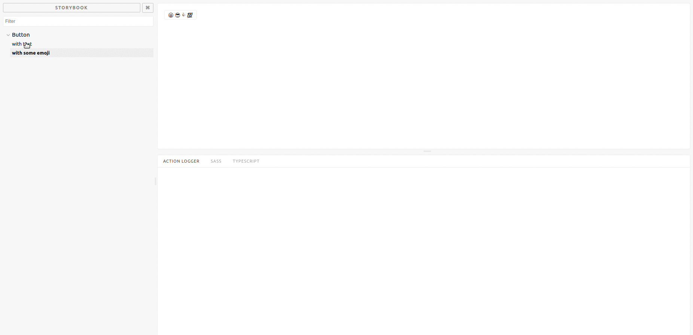

# storybook-addon-code



A Storybook addon enabling to show off code samples in the Storybook panel for your stories in [Storybook](https://storybook.js.org).

### Getting Started

```sh
npm i --save-dev storybook-addon-code
```
### Usage

Create a file called `addons.js` in your storybook config.

Add following content to it:

```js
import * as CodeAddon from '../src/register';
CodeAddon.setTabs(
    [{ label: 'Sass', type: 'sass' }, {label: 'TypeScript', type: 'typescript'}]
);
```
setTab function accept and object like  {label: 'Sass', type:'sass'} or if you want to have multiple tabs you can pass an array with multiple objects. The label will pe displayed in the Storybook panel.


Then write your stories like this:

```js
import { storiesOf } from '@storybook/react';
import withCode from 'storybook-addon-code';
import Button from './Button';

const styleFile = require('raw-loader!./style.scss');
const typescriptFile  = require('./test.tsx');

storiesOf('Button', module)
  .addDecorator(withCode(typescriptFile, 'typescript'))
  .addDecorator(withCode(styleFile, 'sass'))
  .add('with text', () =>
      <Button onClick={action('clicked')}>Hello Button</Button>
    )
```
### Available list of format's for withCode function
1. clike (withCode(YourCFile, 'clike'))
2. css (withCode(YourCssFile, 'css'))
3. html (withCode(YourHtmlFile, 'html'))
4. js | javascript (withCode(YourJavascriptFile, 'js'))
5. markup (withCode(YourMarkupFile, 'js'))
6. mathml (withCode(YourMatHmlFile, 'mathml'))
7. sass (withCode(YourSassFile, 'sass'))
8. svg (withCode(YourSvgFile, 'svg'))
9. ts (withCode(YourTsFile, 'ts'))
10. typescript (withCode(YourTypescriptFile, 'typescript'))
11. xml (withCode(YourXmlFile, 'xml'))

> Have a look at [this example](examples/index.js) stories to learn more about the `withCode` API


