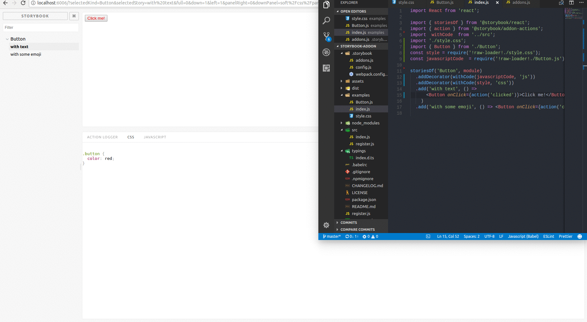
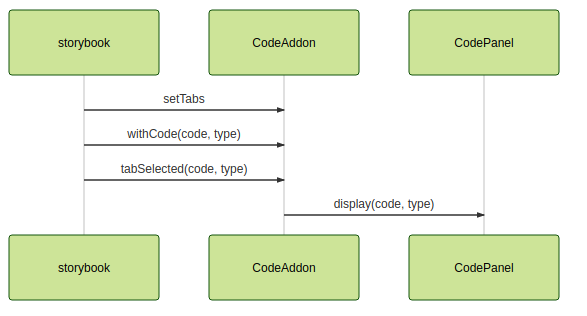

# Introduction

[React Storybook](https://storybook.js.org/) is a javascript library for React, React Native and Vue js where the engineers can develop,design and test the UI components outside your app in an isolated environment.In the recent React project we needed the advantages that Storybook offer and we decided to use it.
The major advantage was that this allows us to develop UI components outside the app and allow other people in our team to work on them.
In this article we are offering the details of a solution we created for a need that is not covered by React Storybook - offering a preview of the styling code used inside various components.

React Storybook ,for those who don't know, has many features including::
1. Completely isolate the environment for your components
2. HMR — hot module replacement
3. Clean and fast user interface
4. Multiple add-ons like: 
    + [Accessibility](https://github.com/joscha/storybook-addon-i18n-tools)
    + [CSS regression](https://github.com/tsuyoshiwada/storybook-chrome-screenshot)
    + [Snapshot testing of React components](https://github.com/storybooks/storybook/tree/master/addons/storyshots)
    + [Knobs allow you to edit React props dynamically](https://github.com/storybooks/storybook/tree/master/addons/knobs)

Just visit the [React Storybook](https://storybook.js.org/addons/addon-gallery/) for full list of features.

# Why another add-on

Recently, on our current, project we come up with a  needed to display the CSS code samples inside the Storybook panel along with the React component. After doing our fair share of research into existing add-ons mentioned earlier we've come up empty.
So we decided to create our own add-on called [storybook-addon-code](https://github.com/SOFTVISION-University/storybook-addon-code) that not only displays CSS code but support other languages like javascript, HTML, typescript etc. 

# How it works

Before we get started, you need to install react storybook and storybook-addon-code.

In your Storybook config folder create a addons.js and add the following code:

```js
import '@storybook/addon-actions/register';
import * as CodeAddon from '../src/register';
CodeAddon.setTabs([
    { label: 'Css', type: 'css' },
    { label: 'JavaScript', type: 'js' }
]);
```
### Note:
``setTab`` function accept and object like ``{label: 'Sass', type:'sass'}`` or if you want to have multiple tabs you can pass an array with multiple objects. The label will pe displayed in the Storybook panel.


Then write your stories like this:
```js
import { storiesOf } from '@storybook/react';
import withCode from 'storybook-addon-code';
import Button from './Button';

const styleFile = require('raw-loader!./style.scss');
const typescriptFile  = require('./test.tsx');

storiesOf('Button', module)
  .addDecorator(withCode(typescriptFile, 'typescript'))
  .addDecorator(withCode(styleFile, 'sass'))
  .add('with text', () =>
      <Button onClick={action('clicked')}>Hello Button</Button>
    )
```


# Supported languages
The plugin has a wide variety of built-in support for common Web programming languages. The most common built-in languages includes:

+ css
+ html
+ javascript
+ scss
+ mathml 
+ sass
+ svg 
+ typescript 
+ xml 

# Anatomy of a Storybook plugin

It turns out developing our custom React Storybook plugin wasn’t that all complicated. You can too, very easily, build your own plugins if you feel the need to.

On a high level, this is how we've build our own:
1. We've created a top level React component ``Code Addon`` that gets displayed in Storybook panel and shows off the code samples.
2. Created a decorator function ``withCode``.This function is used to decorate any stories that need source code info being displayed along side them. ``withCode`` has 2 parameter, source code of the file to display and the type of the file. When is called the function emit a message through a channel that is created dynamically based on the language type.  
4. ``Code Addon`` component listens to that specific channel name and calls a function that renders a text with the received code properly formatted.
5.We used [PrismJS](http://prismjs.com/) for code highlighting and because it can be used with various code samples like CSS, Typescript, Javascript, HTML etc.



For more details on how to build a Storybook addon, access the official [tutorial](https://storybook.js.org/addons/writing-addons/) .


# Future development
We would like to see at least 2 features added to it in the near and medium term:

1. Support for displaying markdown content alongside the component. Usefull for displaying extra info alongside the component being showcased, it would allow us to get rid of an extra plugin like [withReadme](https://github.com/tuchk4/storybook-readme).
2. Extend the built in language collection with additional languages
We are opened to [Pull Requests](https://github.com/SOFTVISION-University/storybook-addon-code), so please don’t hesitate to get involved!

If you like this plugin and find it useful in your day to day work please don’t hesitate to give us a little [Github](https://github.com/SOFTVISION-University/storybook-addon-code) star or tweet about it!
